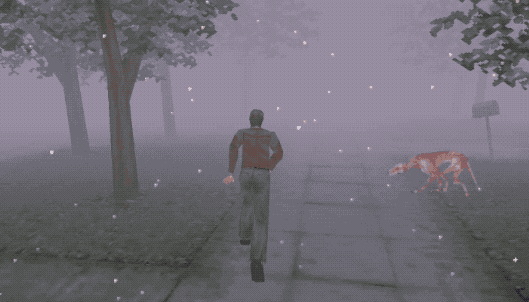
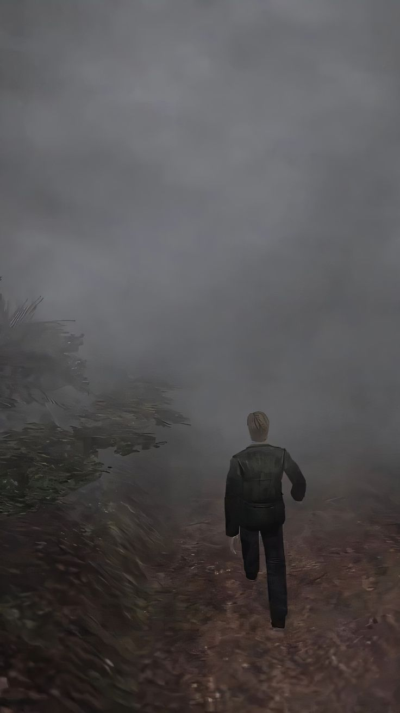
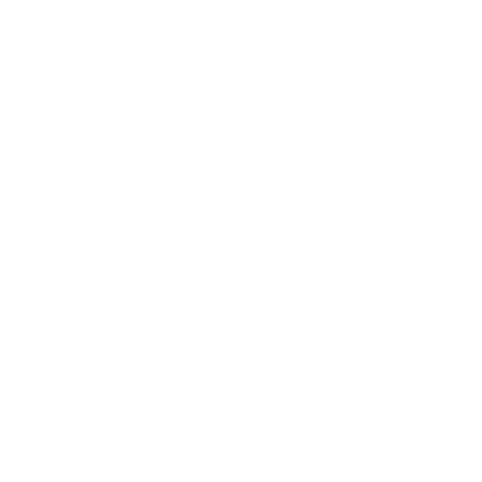

# 3-html-css-Game-card 
## Карточка для старой хоррор игры
**Цель:** Создать простую веб-страницу с информацией о старой хоррор-игре по вашему выбору, используя HTML и CSS. Все страницы должны иметь одинаковую структуру и оформление, предоставленные ниже.
**Задачи:**
1. Выберите игру: Найдите информацию о старой хоррор-игре (выпущенной до 2005 года). Примеры игр: Silent Hill, Resident Evil, Alone in the Dark и т. д.
2. Используя предоставленный HTML и CSS, добавьте информацию об игре:
* Краткое описание (1-2 абзаца).
* Год выпуска.
* Разработчика.
* Основные особенности игры.
* Интересный факт о разработке или её влиянии на индустрию.

Все изображения и файлы должны храниться в одной папке проекта: <br>


### Карточка Silent Hill 2


## html часть
```html
<!DOCTYPE html>
<html lang="en">
<head>
    <meta charset="UTF-8">
    <meta name="viewport" content="width=device-width, initial-scale=1.0">
    <link rel="stylesheet" href="Silent Hill.css">
    <link rel="icon" href="icon.png">
    <!-- fonts -->
    <link rel="preconnect" href="https://fonts.googleapis.com">
    <link rel="preconnect" href="https://fonts.gstatic.com" crossorigin>
    <link href="https://fonts.googleapis.com/css2?family=Didact+Gothic&display=swap" rel="stylesheet">
    <title>About game: Silent Hill 2</title>
</head>
<body>

</body>
</html>
```

### head html
Основной скелет оставим без особых изменений. <br><br>
Поменяем `title` на "About game: Name_Game". Подключим [иконку](https://github.com/TeachKait20/NoneCode/blob/main/games+git/icon.png?raw=true) для страницы. И создадим и соединим файл CSS с HTML. <br><br>
[Шрифт](https://fonts.google.com/selection/embed) - готический. Из библиотеки Google Fonts. Подключить можно через link к `<head>` или import к CSS файлу. <br><br>


### body html
Структура должна быть одинаковой, со скриншотом выше: <br><br>
Изображения/gif можно поискать на разных источниках, например, [Pinterest](https://ru.pinterest.com/). <br><br>

```html
    <div id="content">
        <h1>Silent Hill 2</h1>
        
        <p>Silent Hill 2 is a survival horror computer game developed by the Japanese team Team Silent and published by Konami. The original version of Silent Hill 2 was released on the PlayStation 2 in the United States on September 25, 2001. Within a year, the game was ported to PC and Xbox. HD remastering of Silent Hill 2 was released in 2012 on the PlayStation 3 and Xbox 360 platforms. The Russian distributor of the game was the SoftClub company, it was not localized and was presented in English. In 2024, a remake was released for PlayStation 5 and Windows, developed by the Polish company Bloober Team.</p>
        <p>Silent Hill 2 takes place in a fictional universe in which everyday reality intersects with an alternate world. The main character is James Sunderland, who received a letter from his wife Mary, who died some time before the start of the main events of the game. In the letter, she asks him to come to the resort town of Silent Hill. Having reached his destination, James encounters a mysterious woman named Maria, an almost exact copy of his wife. He eventually realizes that some of his memories were self-deception. The gameplay consists of solving riddles, searching for quest items, exploring locations and fighting the main character with monsters.</p>
        
        <p>The game is not a continuation of the first part of the series, but the action takes place in the same small city located in the northeastern part of the United States of America. License plates on vehicles entering the game are in the state of Michigan. The architecture of the central part of the city was inspired by the real-life settlement of San Bruno.</p>
        <p>The plot of Silent Hill 2 takes place in the southern part of Silent Hill, so the player will not encounter locations from the first part. The power of Silent Hill absorbs what people hold in their hearts and materializes their delusions and fragments of the subconscious. In a parallel world, everyone sees things differently.</p>
        
        <p>There were many "weird" and symbolic elements included in the game. These included red squares that act as save points, a letter that disappears as the story progresses, a traffic light that works in an abandoned city, the circumstances of receiving a pistol, monsters in the real world, unrealistic building structures, etc. At the Historical Society, the protagonist discovers so-called "holes", which also include long downward stairs and vertical corridors. James repeatedly crosses through them, as if something is pulling him. Unusual corridors and doors in the floor indicate that the world seen by the main character is unreal. These holes symbolize the abyss that opened in his heart. They are the road to the depths of the soul.</p>
        <p>The visual techniques used were two symbols of the series: fog and darkness. The purpose of using them is to scare the player. They hide the horizon, limit the field of vision, blur the boundary between sky and earth, creating a fuzzy line between sleep and reality. The fog can be perceived as the thoughts of the dead that rise from the bottom of the lake and spread across Silent Hill. Another feature, the screen noise effect, creates atmosphere and intensifies as the story progresses.</p>
        <div id="end">
            
            <div id="links-end">
                <p>In conclusion, you are given links to the official game on Steam and a guide on Vkplay.</p>
                <span><a href="https://store.steampowered.com/app/2124490/SILENT_HILL_2/?l=russian" target="_blank">Steam</a></span> <br>
                <span><a href="https://media.vkplay.ru/articles/secret/polnoe-prokhozhdenie-silent-hill-2-gaid-po-igre/" target="_blank">Vkplay</a></span>
                
                <p>Guide written by: Paul</p>
            </div>
        </div>
    </div>
```
`div` с id content, будет основным содержимым с контентом. В нём по порядку будут распологаться текст и изображения. <br><br>
Заголовок с игрой будет в `h1`, а остальной текст в абзацах `p`. <br><br>
в `div` links-end и end, конечная информация. <br><br>
В тегах `span` будут ссылки на разные источники с игрой и логотипы.

### CSS
Структура страницы: <br>


Начнём с селектора body, уберём отступы и выполним заливку всей страницы:
```css
body {
    margin: 0;
    padding: 0;
    background-color: rgb(61, 61, 61);   
}
```
Теперь перейдём к блоку content. 

```css
#content {
    background: rgb(19, 19, 19); /* Определим его цвет */
    box-shadow: 10px 15px 15px black; /* Тени */
    color: aliceblue; /* Цвет текста */
    text-decoration: none; /* Уберём декорацию ссылок (подчёркивание) */
    font-family: "Didact Gothic", sans-serif; /* Выберем шрифт (подключали из Google Fonts */
    font-weight: 400; /* Жирность текста (начертание) */
    font-style: normal; /* Стилизация текста */
    font-size: 22px; /* Размер текста */

    height: auto; /* Высота от содержимого блока */
    width: 50%; /* Ширина на половину страницы */
    
    padding: 5px 5px 10px 20px; /* (или: padding-top: 10px; padding-bottom: 10px;) внутренние отступы */
    margin: 3% auto 3% auto; /* (или: margin-left: auto; margin-right: auto;) внешние отступы. Блок по середине с небольними отсупами сверху и снизу по 3% */
}
```
Остальные объекты:
```css
.cover-img {
    width: 80%; 
}


#enimy-gif {
    width: 50%;
}
```
Заключенительный блок:
```css
.icon {
    width: 25px;
    margin-right: 5px;
}

#end {
    display: flex;
}

#img-end {
    width: 30%;
    margin-right: 5%;
}

a {
    color: aliceblue;
    /* text-decoration: none; */
}
```
`#end { display: flex; }` Этот селектор отвечает за контейнер с идентификатором end. Использование свойства `display: flex;` делает контейнер "гибким", позволяя его содержимому располагаться в одну строку (по умолчанию). <br><br>
Flexbox помогает равномерно распределить пространство между элементами и выровнять их по оси. <br><br>
Страница готова, теперь добавим заключительный элемент в виде анимации.

## CSS анимация

Добавим туман на задний план.


HTML-блок, который создаёт контейнер для тумана. Внутри этого контейнера есть дополнительный вложенный элемент `<div>`, необходимый для управления разными слоями тумана:
```html
<div class="fog"><div></div></div>
```
```css
.fog {
    position: fixed; /* Чтобы туман был на фоне */
    top: 0;
    left: 0;
    width: 100%;
    height: 100%; /* Чтобы покрывал всю высоту экрана */
    overflow: hidden;
    background: url("background.jpg") center center;  
    background-size: cover;
    z-index: -1; /* Чтобы туман был под контентом */
}

.fog::before,
.fog::after,
.fog div::before, 
.fog div::after {
    content: "";
    position: absolute;
    top: 0;
    left: 0;
    height: 100%;
    width: 100%;
    background-size: cover;
    background-position: center;
    background-repeat: repeat-x;
}

.fog div::before, 
.fog div::after {
    left: 100%;
}

.fog::before, 
.fog div::before {
    background-image: url("fog-1.png");
    animation: fogmove 20s linear 0s infinite;
}

.fog::after, 
.fog div::after {
    background-image: url("fog-2.png");
    animation: fogmove 10s linear 0s infinite;
}

@keyframes fogmove {
    from {
        transform: translate3d(0, 0, 0);
    }
    to {
        transform: translate3d(-100%, 0, 0);
    }
}
```
1. `fog { ... }`
Этот селектор стилизует основной блок тумана.

* `position: fixed;` - фиксирует блок тумана относительно окна браузера. Он остаётся на месте даже при прокрутке страницы, что делает его подходящим для фона.
* `top: 0; left: 0; width: 100%; height: 100%;` - растягивает блок на весь экран.
* `overflow: hidden;` - скрывает всё, что выходит за пределы контейнера.
* `background: url("background.jpg") center center;` - задаёт фоновое изображение (например, тёмное или мрачное), которое будет за туманом.
* `background-size: cover;` - заставляет фоновое изображение масштабироваться, чтобы покрыть весь экран.
* `z-index: -1;` - этот стиль перемещает блок тумана под весь основной контент сайта, чтобы туман был фоном.

2. `::before` и `::after` псевдоэлементы

Псевдоэлементы используются для добавления дополнительных слоёв тумана, создавая эффект его движения.

* `content: "";` - необходимо для отображения псевдоэлементов.
* `position: absolute;` - позиционирует туман внутри блока, чтобы его можно было перемещать.
* `height: 100%; width: 100%;` - делает туман на весь экран.
* `background-size: cover;` и `background-position: center;` - управляют фоном тумана, делая его адаптивным к экрану.
* `background-repeat: repeat-x;` - позволяет повторять изображение тумана по горизонтали, что создаёт бесконечный эффект при движении.

3. `left: 100%;` (для `div::before` и `div::after`)

Это начальная позиция слоёв тумана. Они начинают за пределами экрана (слева на 100%), чтобы затем "двигаться" по экрану при помощи анимации.

4. Анимации тумана:

* `background-image: url("fog-1.png");` и `background-image: url("fog-2.png");` - у каждого слоя тумана свой рисунок (например, разные текстуры тумана), что создаёт более реалистичный и многослойный эффект.
* `animation: fogmove 20s linear 0s infinite;` - для первого слоя тумана (медленный, 20 секунд).
* `animation: fogmove 10s linear 0s infinite;` - для второго слоя тумана (быстрее, 10 секунд).
* `linear` - анимация идёт с постоянной скоростью.
* `infinite` - анимация повторяется бесконечно.

5. `@keyframes fogmove { ... }`
Это ключевые кадры анимации для движения тумана.

* `from { transform: translate3d(0, 0, 0); }` - туман стартует с начальной позиции.
* `to { transform: translate3d(-100%, 0, 0); }` - туман движется влево на 100%, то есть "уплывает" за экран.
* `translate3d` - используется для создания плавного трёхмерного перемещения, даже если оно происходит только по оси X.

